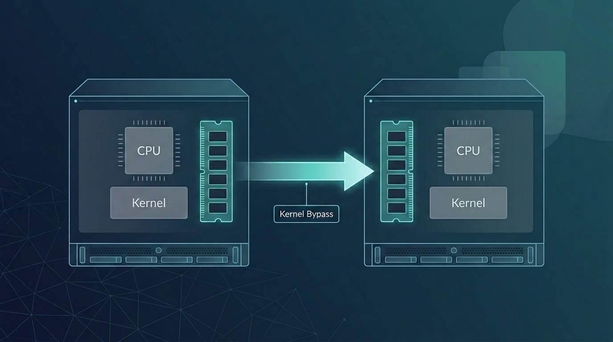
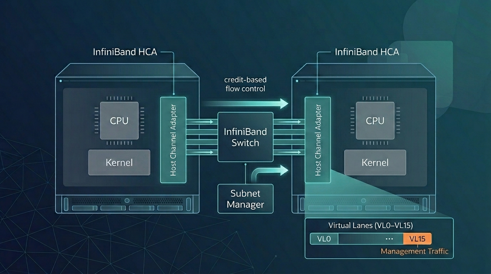
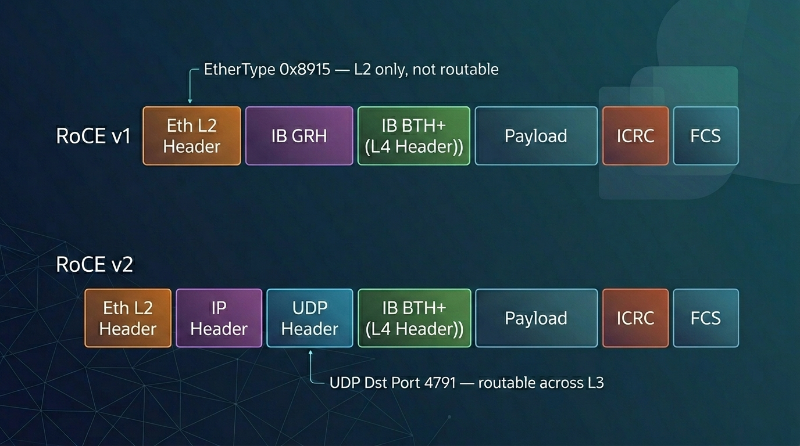

# Remote Direct Memory Access: The Architecture of InfiniBand and RoCE

*1,990 words · about 9 min read*  

*Disclaimer: This post reflects my personal views and learning notes as I worked through the material.*  
*Acknowledgement: The draft was put together with research assistance from AI tools, but I curated the content, edited the prose, and cross-checked the references. The images were generated with Nano Banana.*

## From a 1993 Patent to the Two Fabrics That Carry RDMA Today

<figure style="text-align: center;">
	
	<figcaption><em>Figure: Kernel bypass between source and destination memory paths.</em></figcaption>
</figure>

Remote Direct Memory Access (RDMA) was first codified in a patent filed by Hewlett-Packard engineers in November 1993 [[1]](https://blogs.nvidia.com/blog/what-is-rdma/). The concept extends Direct Memory Access — in which external devices such as network cards access host memory without CPU involvement — to allow memory access between distinct networked hosts, bypassing both CPUs and operating-system kernels [[2]](https://www.naddod.com/blog/what-is-rdma-and-its-application). Over the following three decades, RDMA became foundational to high-performance computing, large-scale AI training, and financial-trading infrastructures [[1]](https://blogs.nvidia.com/blog/what-is-rdma/).

Today, RDMA is carried primarily by two fabrics: InfiniBand and RDMA over Converged Ethernet (RoCE). Both deliver identical RDMA semantics at the application layer, but they differ substantially in their underlying architecture, the way they handle flow control and losslessness, and the hardware and management infrastructure they require [[3]](https://www.linkedin.com/pulse/infiniband-rdma-roce-explained-protocols-messages-network-47otc/). This article surveys each fabric's origin, its working fundamentals, and how the two compare on performance, cost, and deployment.

## How RDMA Works

In a conventional TCP/IP transfer, data moves through several copies and kernel boundaries. The sender copies data from the user-space buffer to the kernel socket buffer, adds protocol headers, copies the data to the NIC buffer, and transmits it. The receiver reverses the process: NIC buffer to kernel, protocol parsing, kernel to user-space. Each copy consumes CPU cycles, and each kernel transition adds latency [[4]](https://www.naddod.com/blog/what-is-rdma-roce-vs-infiniband-vs-iwar-difference).

RDMA removes these copies and kernel transitions through two complementary techniques. The first is *kernel bypass*: the NIC is mapped into user-space memory, allowing applications to post work requests directly through a Verbs API without calling into the kernel [[2]](https://www.naddod.com/blog/what-is-rdma-and-its-application). The second is *NIC offloading*: the entire transport-layer logic, including flow control, reliability, and ordering, runs in silicon on the NIC rather than on the host CPU [[2]](https://www.naddod.com/blog/what-is-rdma-and-its-application). The result is data transfer directly from one process's memory to another's — zero-copy — with near-zero CPU involvement [[4]](https://www.naddod.com/blog/what-is-rdma-roce-vs-infiniband-vs-iwar-difference).

RDMA has three main hardware implementations sharing the same Verbs API but differing at the physical and link layers: InfiniBand, RoCE (v1 and v2), and iWARP, which runs RDMA over TCP/IP [[4]](https://www.naddod.com/blog/what-is-rdma-roce-vs-infiniband-vs-iwar-difference). InfiniBand and RoCE are the two fabrics used in current mainstream deployments [[3]](https://www.linkedin.com/pulse/infiniband-rdma-roce-explained-protocols-messages-network-47otc/).

## InfiniBand: A Purpose-Built RDMA Fabric

The InfiniBand Trade Association (IBTA) was founded in 1999 to define an open standard for high-speed, low-latency networking for high-performance computing and enterprise I/O [[5]](https://www.infinibandta.org/). Mellanox Technologies, later acquired by NVIDIA, led the early hardware development and drove RDMA's integration into mainstream computing [[1]](https://blogs.nvidia.com/blog/what-is-rdma/).

<figure style="text-align: center;">
	
	<figcaption><em>Figure: InfiniBand fabric with HCA endpoints, switch, and management lane context.</em></figcaption>
</figure>

InfiniBand defines a complete protocol stack — Physical, Link, Network, Transport, and Upper Layers — with losslessness, flow control, and addressing built into the hardware contract [[6]](#ref-6).

**Link-layer flow control.** InfiniBand uses credit-based flow control on a per-virtual-lane basis. A receiving port advertises available buffer credits to the sending device, and data is transmitted only when the receiver has advertised sufficient credits. Dedicated link packets manage credit exchange [[6]](#ref-6). This mechanism guarantees losslessness at the link layer without requiring operator configuration.

**Subnet management.** A Subnet Manager handles discovery, Local Identifier assignment, Service-Level-to-Virtual-Lane mapping, and link bring-up and teardown [[6]](#ref-6). Management traffic uses queue pair QP0 on virtual lane VL15, a high-priority lane reserved for subnet management datagrams [[6]](#ref-6). At least one active Subnet Manager must be present in each subnet; standby Subnet Managers maintain copies of the active one's forwarding information for failover [[6]](#ref-6). In production deployments this functionality is commonly implemented through UFM or OpenSM [[3]](https://www.linkedin.com/pulse/infiniband-rdma-roce-explained-protocols-messages-network-47otc/).

**Addressing.** Within a subnet, packets carry a 16-bit Local Identifier (LID). Cross-subnet packets additionally carry a 128-bit Global Identifier (GID) in the Global Route Header, similar in format to an IPv6 address [[3]](https://www.linkedin.com/pulse/infiniband-rdma-roce-explained-protocols-messages-network-47otc/)[[7]](https://datatracker.ietf.org/doc/html/rfc4392).

**Data integrity.** Every InfiniBand packet carries two CRCs: a 16-bit Variant CRC recomputed at each hop for link-level integrity, and a 32-bit Invariant CRC covering fields that do not change hop to hop, providing end-to-end integrity [[6]](#ref-6).

**Transport services.** The transport layer supports five service types: Reliable Connection, Reliable Datagram, Unreliable Connection, Unreliable Datagram, and Raw Datagram [[6]](#ref-6).

**Bandwidth generations.** IBTA specifications have progressed through Single Data Rate (10 Gb/s), Double Data Rate (20 Gb/s), Quad Data Rate (40 Gb/s), and High Data Rate (HDR, introduced in 2017 at 200 Gb/s) [[5]](https://www.infinibandta.org/). Subsequent NDR and XDR generations have delivered 400G, 800G, and 1.6T per-link connectivity [[3]](https://www.linkedin.com/pulse/infiniband-rdma-roce-explained-protocols-messages-network-47otc/).

**Hardware.** An InfiniBand network consists of Host Channel Adapters on servers, Target Channel Adapters on I/O devices, InfiniBand switches, InfiniBand routers, and InfiniBand-specific cabling and optical modules [[3]](https://www.linkedin.com/pulse/infiniband-rdma-roce-explained-protocols-messages-network-47otc/).

## RoCE: RDMA over Ethernet

RoCE emerged as Ethernet became the dominant data-center networking technology, creating demand for RDMA capabilities on existing Ethernet infrastructures rather than on a parallel cable plant [[1]](https://blogs.nvidia.com/blog/what-is-rdma/). RoCE exists in two versions with significantly different packet formats and scopes.

<figure style="text-align: center;">
	
	<figcaption><em>Figure: RoCE v1 L2 encapsulation versus RoCE v2 UDP/IP encapsulation.</em></figcaption>
</figure>

**RoCE v1** operates at the Ethernet link layer, using EtherType 0x8915 to identify RDMA frames. The InfiniBand Base Transport Header and payload are wrapped directly inside an Ethernet L2 frame, so RoCE v1 communication is limited to a single Ethernet broadcast domain and is not routable across Layer 3 [[3]](https://www.linkedin.com/pulse/infiniband-rdma-roce-explained-protocols-messages-network-47otc/)[[8]](https://docs.redhat.com/en/documentation/red_hat_enterprise_linux/7/html/networking_guide/).

**RoCE v2** encapsulates the RDMA payload inside UDP/IP, using UDP destination port 4791. The outer IP header makes RoCE v2 routable across Layer 3 networks. Since Red Hat Enterprise Linux 7.5, RoCE v2 has been the default RDMA Connection Manager protocol on modern NVIDIA ConnectX adapters (ConnectX-3 Pro, ConnectX-4, ConnectX-4 Lx, ConnectX-5, and later) [[8]](https://docs.redhat.com/en/documentation/red_hat_enterprise_linux/7/html/networking_guide/). RoCE v2 is not interoperable with RoCE v1 — a v2 client cannot establish a connection with a v1 server [[8]](https://docs.redhat.com/en/documentation/red_hat_enterprise_linux/7/html/networking_guide/).

**Losslessness and congestion control.** RoCE inherits Ethernet's default lossy behavior, while RDMA semantics require an effectively lossless transport. To bridge this gap, RoCE uses IEEE 802.1Qbb Priority Flow Control (PFC), which pauses specific traffic classes at switch ports to prevent buffer overflow [[9]](https://standards.ieee.org/ieee/802.1Qbb/3834/). RoCE v2 additionally uses Explicit Congestion Notification (ECN) together with congestion-control algorithms such as Data Center Quantized Congestion Notification (DCQCN), which was developed for large-scale RDMA deployments and throttles senders before drops occur [[10]](https://dl.acm.org/doi/10.1145/2829988.2787484). Hyperscale deployments of RoCE at Microsoft additionally adopted DSCP-based PFC to decouple packet priority from VLAN tagging and addressed PFC deadlock, pause-frame storms, and slow-receiver problems at production scale [[11]](https://dl.acm.org/doi/10.1145/2934872.2934908).

**Management.** Unlike InfiniBand's centralized Subnet Manager, RoCE v2 uses a decentralized, distributed model. Discovery, routing, and QoS are handled by the standard Ethernet control plane [[3]](https://www.linkedin.com/pulse/infiniband-rdma-roce-explained-protocols-messages-network-47otc/).

**Hardware.** RoCE networks are built from RoCE-capable NICs and Ethernet switches. Major NIC manufacturers include NVIDIA and Broadcom, and Ethernet switches for RoCE scenarios are produced by NVIDIA, Cisco, HPE, and Arista [[3]](https://www.linkedin.com/pulse/infiniband-rdma-roce-explained-protocols-messages-network-47otc/). Broadcom's Tomahawk 6 switching silicon supports Ethernet switching capacity up to 102.4 Tbps, and NVIDIA's ConnectX-9 super NIC provides 1×800G per-port in Ethernet mode [[3]](https://www.linkedin.com/pulse/infiniband-rdma-roce-explained-protocols-messages-network-47otc/). Standard Ethernet optical modules and cables are compatible with RoCE [[3]](https://www.linkedin.com/pulse/infiniband-rdma-roce-explained-protocols-messages-network-47otc/).

## Performance

InfiniBand's protocol stack, designed around RDMA from the physical layer upward, delivers high transmission efficiency at microsecond-range end-to-end latency [[3]](https://www.linkedin.com/pulse/infiniband-rdma-roce-explained-protocols-messages-network-47otc/). Current-generation InfiniBand supports per-link speeds of 400 Gb/s (NDR), 800 Gb/s, and 1.6 Tb/s (XDR) [[3]](https://www.linkedin.com/pulse/infiniband-rdma-roce-explained-protocols-messages-network-47otc/). RoCE v2 on correctly configured lossless Ethernet delivers comparable performance for most data-center workloads [[3]](https://www.linkedin.com/pulse/infiniband-rdma-roce-explained-protocols-messages-network-47otc/).

## Cost and Deployment

RoCE uses standard Ethernet optics, cabling, and commodity switch silicon, giving it a lower component-level hardware cost than InfiniBand's dedicated Host Channel Adapters, switches, and cabling [[3]](https://www.linkedin.com/pulse/infiniband-rdma-roce-explained-protocols-messages-network-47otc/). Operational characteristics differ in ways that affect total cost. Large-scale RoCE deployments documented by Microsoft Azure required resolving a series of safety and performance problems with PFC — including deadlocks, pause-frame storms, and slow-receiver behavior — and depended on careful switch configuration, cable qualification, and firmware management to maintain the lossless behavior RDMA requires [[11]](https://dl.acm.org/doi/10.1145/2934872.2934908).

InfiniBand carries a lower per-port power footprint: an InfiniBand copper PHY consumes approximately 0.25 watts per port, compared with approximately 2 watts per port for a Gigabit Ethernet PHY. This difference reflects InfiniBand's design for shorter data-center distances rather than the 100-meter spans Ethernet PHYs are specified for [[6]](#ref-6). InfiniBand also uses fewer switches and cables than comparable shared-bus alternatives at similar bandwidth [[6]](#ref-6).

## RDMA in HPC and AI

<figure style="text-align: center;">
	
	<figcaption><em>Figure: High-density AI infrastructure where RDMA fabrics are commonly deployed.</em></figcaption>
</figure>

RDMA's earliest widespread use was in high-performance computing, where the Message Passing Interface (MPI) wrapped RDMA operations in a programming model already familiar to HPC developers [[1]](https://blogs.nvidia.com/blog/what-is-rdma/). InfiniBand became the interconnect for many Top500 supercomputers, supporting scientific workloads in physics, biology, and meteorology [[5]](https://www.infinibandta.org/).

RDMA is central to modern AI model training. Interconnecting multiple GPUs to move the data volumes required by billion-parameter models depends on RDMA's low latency and high bandwidth [[1]](https://blogs.nvidia.com/blog/what-is-rdma/). InfiniBand switches such as NVIDIA's Quantum-2 platform, which provides 400 Gb/s per port, are deployed to minimize congestion across GPU clusters in non-blocking topologies [[12]](https://www.nvidia.com/en-us/networking/quantum-2/). RoCE v2 is deployed at hyperscale in other environments and is supported by platforms such as NVIDIA Spectrum-X, which adds in-band telemetry and adaptive routing on top of standard Ethernet to manage congestion in high-traffic scenarios [[13]](https://www.nvidia.com/en-us/networking/spectrum-x/).

RDMA is also used in financial systems, where ultra-low latency is required for transaction execution and real-time market data processing, and in virtualized storage environments, where hypervisor-level RDMA support enables data transfer between virtual machines and storage resources [[1]](https://blogs.nvidia.com/blog/what-is-rdma/).

---

## References

**[1]** Abhinav Sharma. "How RDMA Became the Fuel for Fast Networks." *NVIDIA Blog.* Available at: https://blogs.nvidia.com/blog/what-is-rdma/

**[2]** Dylan. "What is RDMA and its application?" *NADDOD Blog,* July 7, 2023. Available at: https://www.naddod.com/blog/what-is-rdma-and-its-application

**[3]** NADDOD. "InfiniBand RDMA and RoCE Explained: Protocols, Messages, and Network Architecture." *LinkedIn,* December 22, 2025. Available at: https://www.linkedin.com/pulse/infiniband-rdma-roce-explained-protocols-messages-network-47otc/

**[4]** Gavin. "What is RDMA? RoCE vs. InfiniBand vs. iWARP Difference." *NADDOD Blog,* December 15, 2023. Available at: https://www.naddod.com/blog/what-is-rdma-roce-vs-infiniband-vs-iwar-difference

**[5]** InfiniBand Trade Association. *InfiniBand Architecture Specification* and related documentation. Available at: https://www.infinibandta.org/

**[6]** Mellanox Technologies, Inc. *Introduction to InfiniBand™.* White Paper, Document Number 2003WP, Rev 1.90. (Primary technical reference for InfiniBand link layer, flow control, CRC scheme, transport services, and PHY characteristics.) No stable public URL; see reference list entry.

**[7]** V. Kashyap. *IP over InfiniBand (IPoIB) Architecture.* RFC 4392, IETF, April 2006. Available at: https://datatracker.ietf.org/doc/html/rfc4392

**[8]** Red Hat, Inc. *Red Hat Enterprise Linux 7 Networking Guide,* Chapter on InfiniBand and RDMA Networks (section on Transferring Data Using RoCE). Available at: https://docs.redhat.com/en/documentation/red_hat_enterprise_linux/7/html/networking_guide/

**[9]** IEEE Std 802.1Qbb-2011. *IEEE Standard for Local and Metropolitan Area Networks — Virtual Bridged Local Area Networks — Amendment 17: Priority-based Flow Control.* Available at: https://standards.ieee.org/ieee/802.1Qbb/3834/

**[10]** Y. Zhu, H. Eran, D. Firestone, C. Guo, M. Lipshteyn, Y. Liron, J. Padhye, S. Raindel, M. H. Yahia, and M. Zhang. "Congestion Control for Large-Scale RDMA Deployments." *ACM SIGCOMM 2015.* (DCQCN.) Available at: https://dl.acm.org/doi/10.1145/2829988.2787484

**[11]** C. Guo, H. Wu, Z. Deng, G. Soni, J. Ye, J. Padhye, and M. Lipshteyn. "RDMA over Commodity Ethernet at Scale." *ACM SIGCOMM 2016.* Available at: https://dl.acm.org/doi/10.1145/2934872.2934908

**[12]** NVIDIA Corporation. *NVIDIA Quantum-2 InfiniBand Platform.* Product documentation. Available at: https://www.nvidia.com/en-us/networking/quantum-2/

**[13]** NVIDIA Corporation. *NVIDIA Spectrum-X Ethernet Networking Platform.* Product documentation. Available at: https://www.nvidia.com/en-us/networking/spectrum-x/